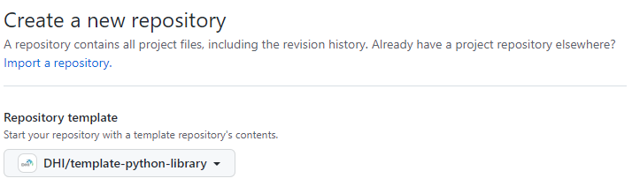

# my_library: Template Python repository

This repository serves as a template for creating a Python library

## How do I use this?

1. Create a new repository in GitHub with this repo as a starting point
    

2. Change all occurences of `my_library` to match the name of your new library

3. Consider if the [license](LICENSE) should be modified.

## Devcontainer setup

The `devcontainer.json` specification provided in the `.devcontainer` folder provides a reference environment for development and testing. The devcontainer is based on the repo-wide `Dockerfile` provided, but a devcontainer specific `Dockerfile` can also be created if the development and productions needs diverge. If development of the library requires multiple services, consider using a [docker-compose based devcontainer setup](https://code.visualstudio.com/docs/devcontainers/create-dev-container#_use-docker-compose).

### Ruff configuration

Ruff is the linter of choice, and the default provided setup is currently used. For configuration of Ruff for specific project needs directly in the `pyproject.toml`, see [here](https://beta.ruff.rs/docs/configuration/#using-pyprojecttoml).